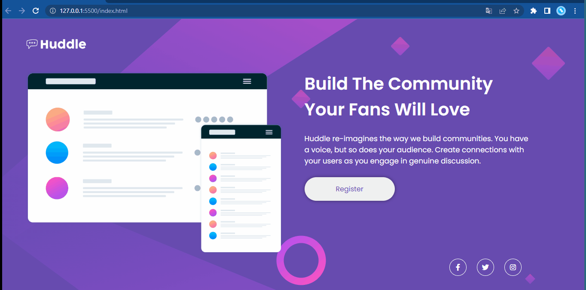

# Frontend Mentor - Página inicial do Huddle com solução de seção introdutória única

Esta é uma solução para o [desafio da página inicial do Huddle com uma única seção introdutória no Frontend Mentor](https://www.frontendmentor.io/challenges/huddle-landing-page-with-a-single-introductory-section-B_2Wvxgi0) . Os desafios do Frontend Mentor ajudam você a melhorar suas habilidades de codificação criando projetos realistas.

## Índice

- Visão geral
  - [O desafio](#the-challenge)
  - [Captura de tela](#captura-de-tela)
  - [Links](#links)
(#desenvolvimento-contínuo)
  - [Recursos úteis](#useful-resources)

- [Agradecimentos](#agradecimentos)

## Visão geral

### O desafio

Os usuários devem ser capazes de:

- Visualize o layout ideal para a página, dependendo do tamanho da tela do dispositivo
- Veja os estados de foco para todos os elementos interativos na página

### Captura de tela

### Links

- URL do site ao vivo: [Adicione o URL do site ao vivo aqui](https://your-live-site-url.com)

### Construído com

- Marcação HTML5 semântica
- Propriedades personalizadas de CSS
- Flexbox

## Agradecimentos

https://www.youtube.com/results?search_query=dev+em+dobro

https://www.youtube.com/results?search_query=curso+em+video
